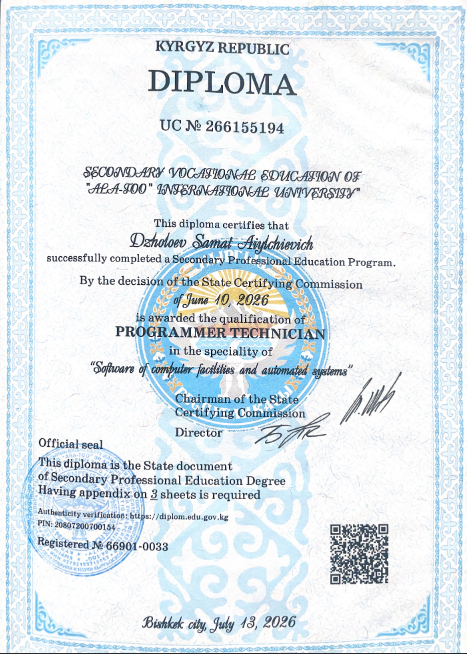

# Hi, I'm Samat Dzholoev

Graduate of **IT & Business College at Ala-Too International University** 
Major: **Software Engineering**
- **GPA:** 3.09
- **Total Credits:** 200 ECTS
- **Focus Areas:** Backend Development (Python), Web Technologies, OOP and Database Systems.

---

## Tech Stack & Skills

- **Programming Languages:** Python, JavaScript, HTML/CSS
- **Tools & Technologies:** Git, GitHub, Databases (SQL/SQLite), AI-Assisted Development
- **Languages:** English, Russian, Kyrgyz

---

## Projects

### 1. [Steppe Go](https://github.com/NamaeNoName/steppe-go)
* **Description:** Web-based 2D idle RPG inspired by the nomadic culture of Central Asia.
* **Technologies:** HTML, CSS, JavaScript
* **Code:** [Project Repository](https://github.com/NamaeNoName/steppe-go)

---

### 2. [Gym Management System](https://github.com/NamaeNoName/gym-management-system)
* **Description:** Management system for fitness centers designed to manage clients and membership subscriptions.
* **Technologies:** JavaScript, Web Interface
* **Code:** [Project Repository](https://github.com/NamaeNoName/gym-management-system)

---

### 3. [ProjectB](https://github.com/NamaeNoName/ProjectB)
* **Description:** Educational project focusing on software architecture and core programming principles.
* **Code:** [Project Repository](https://github.com/NamaeNoName/ProjectB)

---

## Education & Certificates

### IT & Business College Diploma

<!--  -->

---

